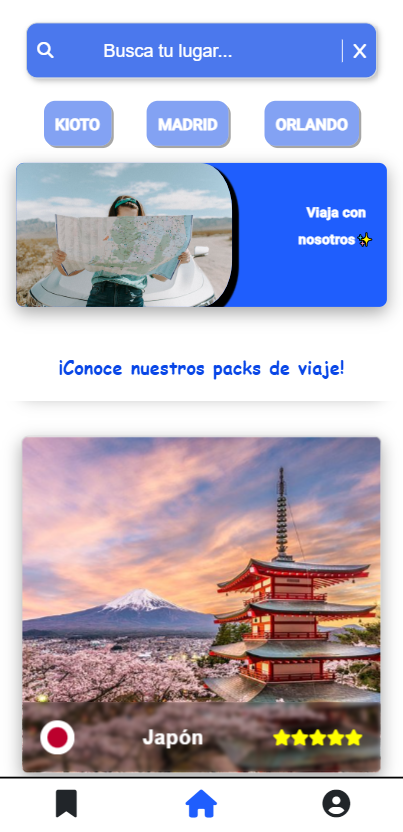
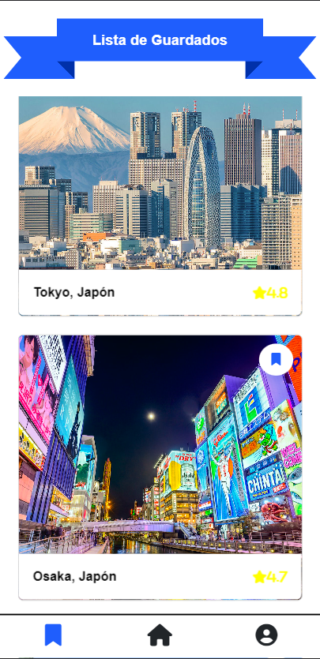
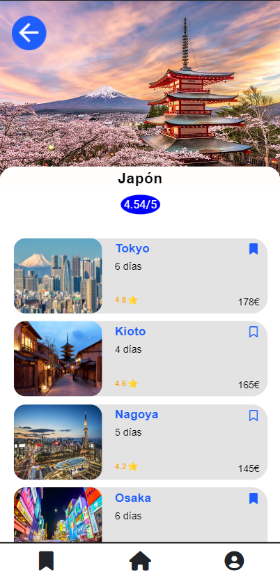
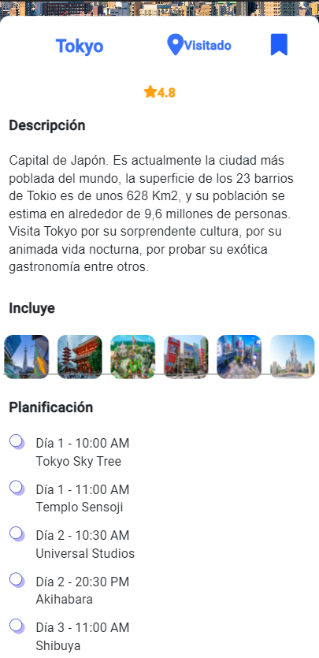
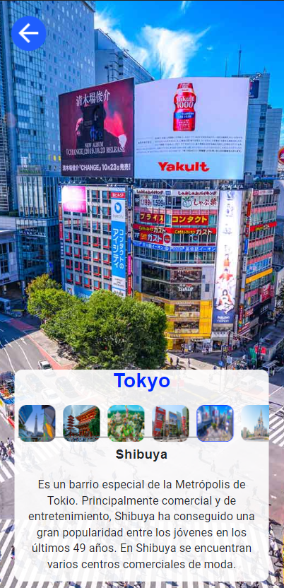
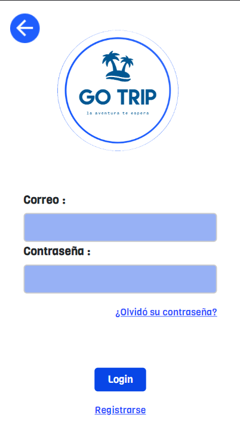
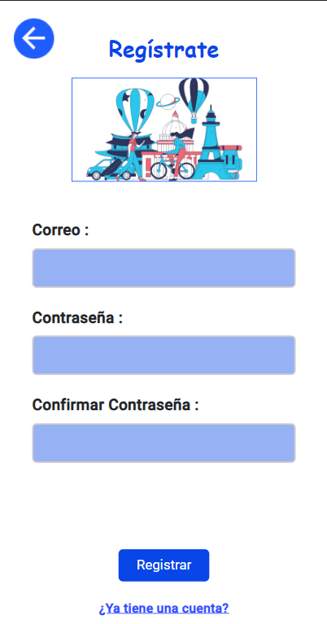
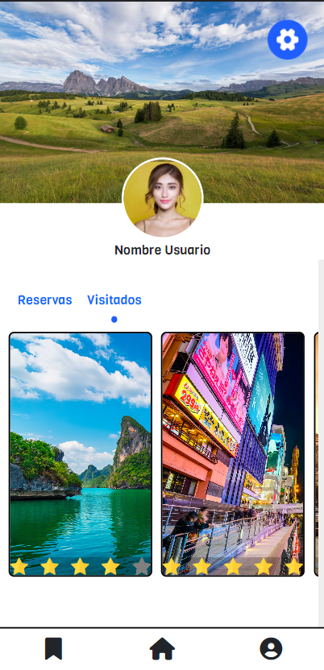
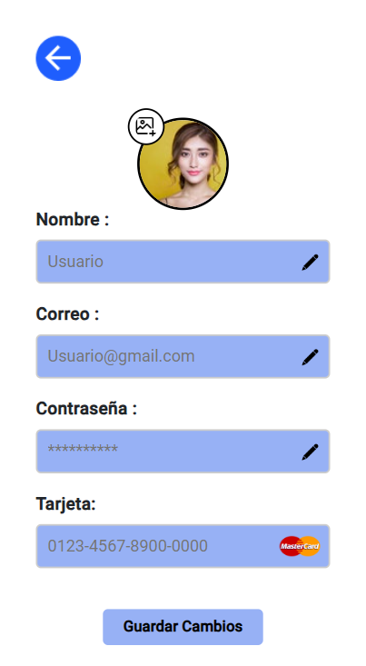

<h1 align="center"><b>🧳GoTrip🛫</b></h1>
<h2 align="center"><i>La aventura te espera...</i></h2>

<hr>

<p>GoTrip es una aplicación móvil basada en la gestión de viajes alrededor del mundo. Los viajes se encuentran divididos en packs de países, los cuáles contienen propias travesías a ciudades de gran interés. Además, cuenta con un sistema de aviso al usuario cada vez que realiza alguna operación, para conocer en todo momento dónde se encuentra.</p>
<p>Este proyecto se realizó para la asignatura de <b>Interfaces de Usuario</b>, con el fin de crear una aplicación que cumpliese con todos o la mayoría de los principios usabilidad.</p>


<div align="center">
  
</div>
<hr>

<h3>Lenguajes y herramientas usadas</h3>

<a href="https://angular.io" target="_blank"></a>
<a href="https://www.w3.org/html/" target="_blank" rel="noreferrer"> </a>
<a href="https://www.typescriptlang.org" target="_blank" rel="noreferrer"> </a>
<a href="https://www.jetbrains.com/es-es/webstorm/" target="_blank"></a>
<a href="https://developer.android.com/studio" target="_blank"></a>

<hr>

<h3>Instalación</h3>

<p>Para lanzar y poder navegar por la aplicación se tienen 2 opciones, dependiendo de por qué medio se quiera visualizar:
  <ul>
    <li>📱<b>Móviles</b>: Ejecutar el archivo .apk</li>
    <li>💻<b>Ordenador</b>: Lanzar el proyecto a través de la terminal</li>
  </ul>
</p>

<h4>📱<b>Móvil</b></h4>

<p>El archivo que se llama GoTrip.apk, solo haría falta descargarlo y ejecutarlo, para que instale la aplicación. Una vez instalada ya se puede acceder a todas las funcionalidades.</p>

<h4>💻<b>Ordenador</b></h4>

<p>Para poder lanzar la aplicación en el ordenador, tras descargar el .zip y descomprimirlo dónde se quiera. A continuación abra una terminal y navege hasta dónde situó el proyecto. 
Debe encontrarse con una ruta parecida a esta: </p>

```
PS C:\Users\[nombre del usuario]\[Lugar donde lo guardó]\GoTrip> 
```

<p>Introduzca el siguiente comando: </p>

```
cd GoTrip
```

<p>Y una vez dentro debe instalar todas las librerías necesarias para que funcione correctamente, con: </p>

```
npm install
```

<p>Terminada la instalación, ejecute: </p>

```
ng serve -o
```

<p>Y tendrá desplegada la aplicación en su navegador web.</p>

<hr>

<h3>Aspecto de la aplicación</h3>

<p>La aplicación consta de varias ventanas, en la que se pueden realizar diferentes acciones.</p>
<p align="center">
  
  
  
</p>

<hr>

<p align="center">
  
  
  
</p>


<hr>

<p align="center">
  
  
</p>

<hr>

<p align="center">
  
  
  
</p>

